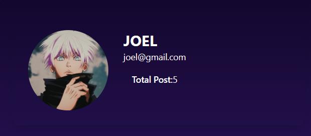

## ***Social-Media***

[](LICENSE)  
[](https://github.com/gaur-j/Social-Media/actions)  
[](https://github.com/gaur-j/Social-Media)  
[](https://github.com/gaur-j/Social-Media)

---

## ***📌 Table of Contents***
- [About](#about)
- [Features](#features)
- [Screenshots](#screenshots)
- [Tech Stack](#tech-stack)
- [Getting Started](#getting-started)
- [Usage](#usage)
- [Contributing](#contributing)
- [License](#license)
- [Contact](#contact)

---

## ***About***
A **lightweight social media interface** built with a modern dark theme, allowing users to post images, comment, like, and manage uploads.

---

## ***Features***
- ✅ User authentication (sign up, login)
- 📸 Image posting with captions
- 💬 Commenting, liking functionality

---

## ***Screenshots***




> 📽️ ***Demo Video:*** 
> Watch a walkthrough of the project 👉 [demo.mp4](docs/social-app.mp4)

---

### ***🧰 Tech Stack***


---

## ***🚀 Getting Started***

### Prerequisites
- Node.js (v16+)
- MongoDB (local or Atlas)

### Installation
1. Clone the repo  
   ```bash
   git clone https://github.com/gaur‑j/Social‑Media.git
   cd Social‑Media
   
2. Install dependencies
   ```bash
   npm install
   
3. Set up environment variables
   Copy .env.example → .env and fill:
   ```ini
   PORT=5000
    MONGO_URI=your_mongodb_uri
    JWT_SECRET=your_jwt_secret
   
4. Run development server
   ```bash
   npm run dev
   
5. Check it out at:
   http://localhost:5173

---

## ***Usage***
1. Register or log in
2. Upload an image (supported formats: JPG, PNG, PNEG, JPEG, MOV, MP4)
3. Add captions, post, like, and comment
4. View and manage your uploads

---

## ***Contributing***
**Contributions are welcome!**
1. Fork it
2. Create a feature branch:
   ```bash
   git checkout -b feat/YourFeature
3. Commit with descriptive message:
   ```bash
   git commit -m 'feat: add new feature'
4. Push:
   ```bash
   git push origin feat/YourFeature
5. Open a PR and wait for feedback

---

## ***❤️ Contact***
**Gaurav – @gaur-j**

**Project Link: https://github.com/gaur-j/Social-Media**
